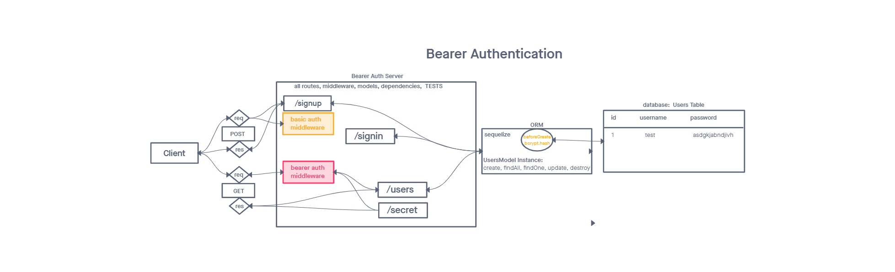

# LAB - Class 07: bearer-auth

## Author: Student/Group Name

## Problem Domain

A simple server to practice bearer authentication

## Links and Resources

- [ci/cd](https://github.com/DSFrey/bearer-auth/actions)

### `.env` requirements

i.e.

- `PORT` - Port Number
- `DATABASE_URL` - URL to the running Postgres instance/db
- `SECRET` - secret for jwt authentication

### How to initialize/run your application (where applicable)

- `npm run db:config` then edit the created config file.
- `npm run db:create` to create the database.
- `npm start` to start the application.

### Features / Routes

- POST : `/signup` - creates a new user
- POST : `/signin` - verifies a user against the database
- GET  : `/users` - requires bearer auth to retrieve a list of users in the database

### Tests

- Tests are run with `npm test`
- verify that a user can be created, a correct login succeeds, and an incorrect login fails

### UML

;
